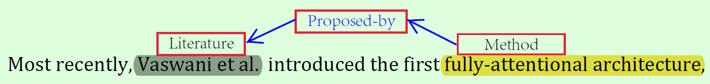
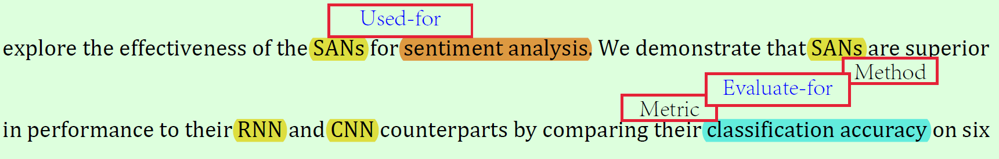
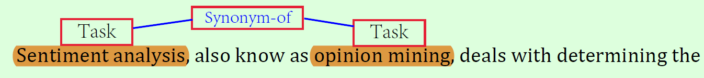
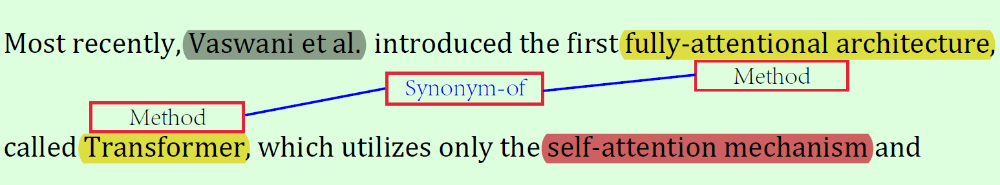

### About raw data
- Some words in paper are cut because of typesetting, and these words are represented as prehalf-backhalf.
    + These words are taken into consideration whening pre-preprocessing???
    + If not, this will be a problem when look up in Embedding table.
	


### About annotation
- annotation guideline
    + [pdf1](http://ssli.ee.washington.edu/tial/projects/sciIE/annotation_guideline.pdf): more annotation examples.
    + [pdf2](http://nlp.cs.washington.edu/sciIE/annotation_guideline.pdf): fix some typo.
- ```Greedy```:Spans can be embedded in longer spans, only if the shorter span is involved in a relation.
- If generic phrases are not involved in a relation, do not tag them
    + **???** *involved in a relation* **???** in pdf1 Figure 1 sentence #3 approach-Generic
    + This can be done by post-delete operation.
- **???** some terms are difficult to recognize. **???**
- "Multi-...KGC" mentioned that the dataset is annotated by experts.
- Expression following the phrase "such as" has three components or more.
    + all of them are involved in the relation of *conjunction*

### Beyond these 6 Relation & Entity Type
- Entity **Literature**
- Relation **Evaluate-for** in pdf1 Figure 3 sentence #6
- Relation **Proposed-by**, **Synonym-of**

### Tools
- [BRAT](http://brat.nlplab.org): a annotation tool. [paper](http://www.anthology.aclweb.org/E/E12/E12-2021.pdf)
- [pandoc](http://pandoc.org/): a ```tex to word``` tool. [download](https://github.com/jgm/pandoc/releases/tag/2.5)
    + usage:
    ```
    pandoc -s paper.tex -o paper.docx
    ```

### Final Entity & Relation Type
| Entity | Relation |
|:------ |:------ |
| 1. Task | 1. Used-for |
| 2. Method | 2. Feature-of |
| 3. Evaluation Metric | 3. Hyponym-of |
| 4. Material | 4. Part-of |
| 5. Other Scientific Terms | 5. Compare |
| 6. Generic | 6. Conjunction |
| 7. **Literature** | 7. **Evaluate-for**
|                   |8. **Proposed-by**
|                   |9. **Synonym-of**

#### Entity *Literature*,Relation *Proposed-by*

#### Relation *Evaluate-for*

#### Relation *Synonym-of*




